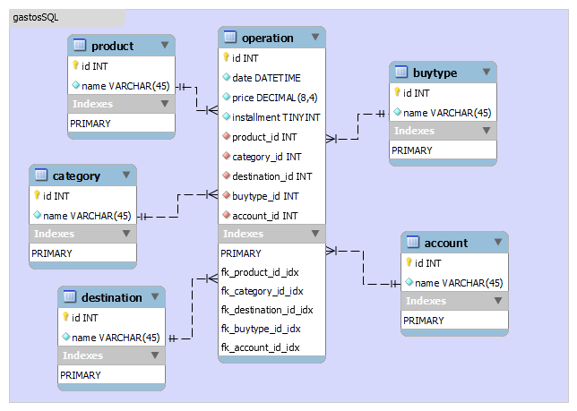

# ExcelToSQL
Código Python que retorna as listas de INSERT INTO para o PostgreSQL, com base em colunas de um arquivo Excel.

Excel + Python -> PostgreSQL
### Pré Requisitos 1: 
Primeiramente é necessário já ter uma noção da estrutura do banco de dados que vai ser criado. Utilizei o [MySQL Workbench](https://www.mysql.com/products/workbench/) para criar essa estrutura visual do banco de dados, como segue: 

.

Assim sei que preciso criar as chaves estrangeiras da tabela principal "operation" após a criação de todas outras tabelas. O tema de gastos é apenas um exemplo, o código funciona com qualquer planilha, com as devidas alterações nos nomes das colunas no código.

As tabelas também já devem ter sido criadas corretamente antes dos inserts. [Aqui tabelas exemplo](https://github.com/areeswp/ExcelToSQL/files/7954452/TabelaEx.txt)

E posteriormente devem ser alteradas as devidas tabelas, para adicionar as chaves estrangeiras, [conforme exemplo](https://github.com/areeswp/ExcelToSQL/files/7954454/Constraints.txt)
### Pré Requisitos 2:
Para o funcionamento do código é necessário instalar duas bibliotecas:
  1. pandas ( pip install pandas )
  2. numpy ( pip install numpy )
  
O código está disponível em:
  - [.py:](tosql.py) código python básico (estruturado em células, utilizando # %%), apresenta o retorno todo no terminal, porém as células podem ser executadas independentemente.
  - [.ipynb:](tosql.ipynb) jupyter notebook (estrutura padrão já em células), apresenta os retornos logo abaixo das respectivas células.

## Como usar:
Primeiramente é necessário alterar o endereço do arquivo excel na primeira célula do código. A mesma célula já lista as colunas, para facilitar a conferência dos nomes.

No exemplo que utilizei as colunas estão distribuidas desta forma:

|date|category|product|buytype|destination|account|price|installment|
|---|---|---|---|---|---|---|---|
|col 0|col 1|col 2|col 3|col 4|col 5|col 6|col 7|

A estrutura do código é dividida em partes, cada parte resolve o insert de uma coluna diferente. No exemplo do código a primeira id criada é a de account. O código `df.insert(5, "id_account", np.nan)` cria uma coluna cheia de valores nulos com o nome "id_account" na posição da coluna 5, e o dataframe é alterado dessa forma:

|date|category|product|buytype|destination|id_account|account|price|installment|
|---|---|---|---|---|---|---|---|---|
|col 0|col 1|col 2|col 3|col 4|col 5|col 6|col 7|col 8|

Da mesma forma para o restante das colunas, dessa forma devem ser alteradas:
  1. O número da coluna.
  2. O nome da coluna.
  - Também deve ser observado se a sua tabela requer outros dados, como uma outra chave estrangeira, e realizar as mudanças necessárias.

### Este é o retorno da segunda célula no exemplo, da account:

>INSERT INTO account
>    
>>>VALUES (1, 'Nubank Crédito'),
>	 
>>>(2, 'Nubank Débito'),
>		 
>>>(3, 'Boleto'),
>		 
>>>(4, 'Inter Crédito'),
>		 
>>>(5, 'Dinheiro'),
>		 
>>>;

A única formatação necessária de alterar nesse retorno, antes de inserir no PostgreSQL, é apagar a última vírgula da lista. Porém também é importante notar que o PostgreSQL não aceita aspas em nomes, e é retornado um erro no query.

A estrutura do retorno final, no exemplo, é dessa forma: `id, data, preço, parcela, id_produto, id_categoria, id_destino, id_tipo_de_compra, id_conta`

### Este é o início do retorno de operations:

>INSERT INTO operation
>
>>>VALUES  (1, '2021-01-04 00:00:00', 105.13, 1, 1, 1, 1, 1, 1),
>>>
>>> (2, '2021-01-10 00:00:00', 15.0, 1, 2, 2, 2, 1, 2),
>>> 
>>> (3, '2021-01-11 00:00:00', 222.36, 1, 3, 3, 3, 2, 1),
>>> 
>>>	(4, '2021-01-11 00:00:00', 60.68, 1, 4, 4, 4, 2, 1),
>>>	
>>>	(5, '2021-01-22 00:00:00', 15.0, 1, 2, 2, 2, 1, 2),
>>>
>>>...

Vou deixar um [arquivo excel](https://github.com/areeswp/ExcelToSQL/files/7954636/gastosPY.xlsx) para testes à disposição no repositório. 
